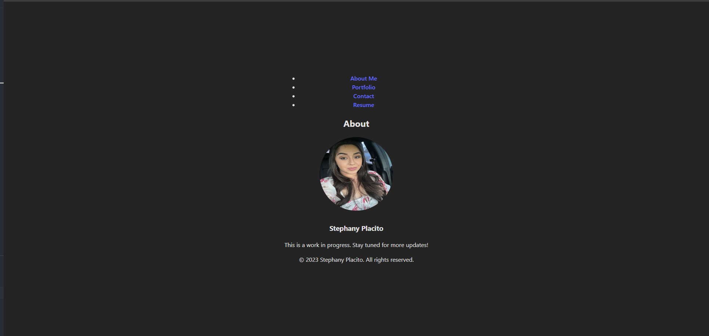

# 20 Moonchild-2, React Portfolio

​

## Description

​Create a personal portfolio website using React, showcasing your skills and projects. The website should include multiple sections such as "About Me," "Portfolio," "Contact," and "Resume." Use React Router for navigation between different sections. Each section should have its own component, and the portfolio should feature images and details of your projects.

## Tasks

Set Up React App: Create a new React app using a tool like Vite or Create React App.

Component Creation: Develop individual React components for each section of the portfolio (e.g., About, Portfolio, Contact, Resume).

Navigation: Implement navigation using React Router to allow seamless transitions between different sections.

Styling:Apply styles to enhance the visual appeal of your portfolio using CSS or a styling library.

Project Integration: Integrate images and details of your projects into the Portfolio section.

Link Navigation: Ensure navigation links in the Header and Navigation components are correctly linked to the corresponding sections.

Responsive Design: Make the portfolio website responsive to different screen sizes for a better user experience.

Testing: Test the website to ensure all links work correctly, and the layout is consistent across different devices.

Profile Picture Adjustment: Adjust the size and styling of your profile picture in the About section.

## Usage

​

## Links

Githib link- https://github.com/splacito22/moonchild-2

Deployed pages link- https://app.netlify.com/sites/strong-biscotti-b9df60/deploys/6563d144e2e6884c7d89bb83
​

​

## Credits

https://react.dev/reference/react
https://vitejs.dev/guide/static-deploy.html#netlify

## License

​
MIT License
​
Copyright (c) [2023] [Stephany]
​
Permission is hereby granted, free of charge, to any person obtaining a copy
of this software and associated documentation files (the "Software"), to deal
in the Software without restriction, including without limitation the rights
to use, copy, modify, merge, publish, distribute, sublicense, and/or sell
copies of the Software, and to permit persons to whom the Software is
furnished to do so, subject to the following conditions:
​
The above copyright notice and this permission notice shall be included in all
copies or substantial portions of the Software.
​
THE SOFTWARE IS PROVIDED "AS IS", WITHOUT WARRANTY OF ANY KIND, EXPRESS OR
IMPLIED, INCLUDING BUT NOT LIMITED TO THE WARRANTIES OF MERCHANTABILITY,
FITNESS FOR A PARTICULAR PURPOSE AND NONINFRINGEMENT. IN NO EVENT SHALL THE
AUTHORS OR COPYRIGHT HOLDERS BE LIABLE FOR ANY CLAIM, DAMAGES OR OTHER
LIABILITY, WHETHER IN AN ACTION OF CONTRACT, TORT OR OTHERWISE, ARISING FROM,
OUT OF OR IN CONNECTION WITH THE SOFTWARE OR THE USE OR OTHER DEALINGS IN THE
SOFTWARE.

## Acknowledgements

I would like to express my gratitude and appreciation to the following individuals, study groups, and AskBCS Learning Assistant for their contributions and support during the completion of this project:

Josh Taylor- For their course materials and resources provided, including lecture slides, tutorials, and code examples. These materials have been invaluable in helping me grasp the concepts and apply them to create this project.

Study Group/Zoom Breakout Rooms (w/Marc H, Evan Griggs, Jaime, Rob, Kayla) - for their collaboration, discussions, and sharing of knowledge during our study sessions.

AskBCS for their assistance, prompt responses, and helpful resources.
